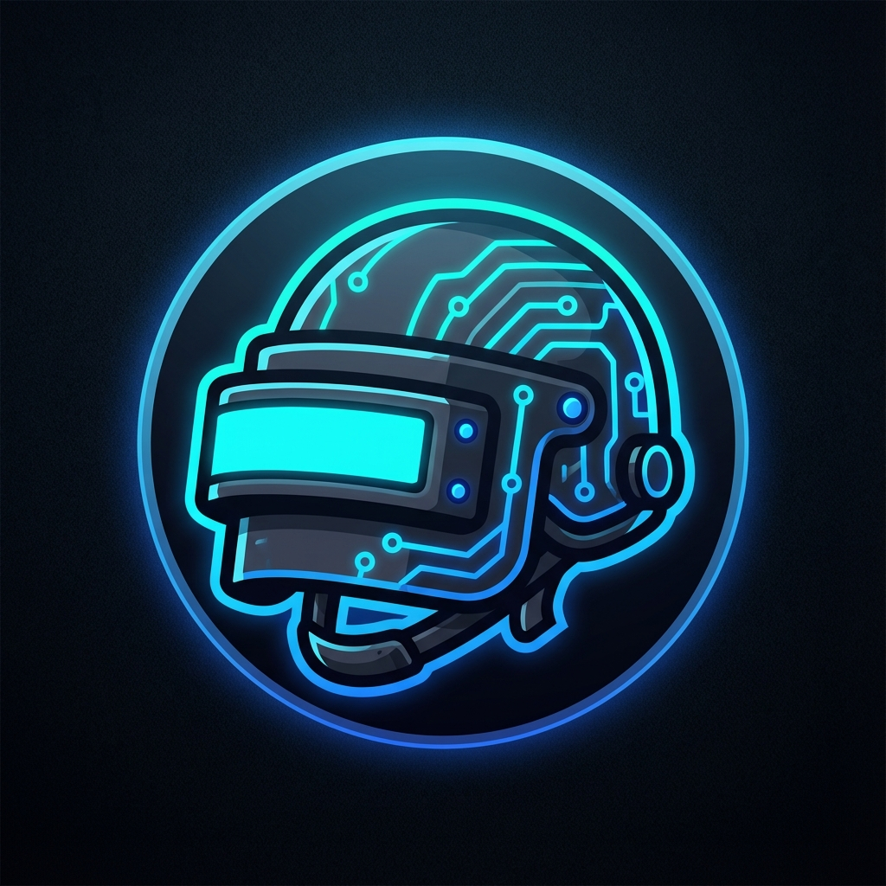
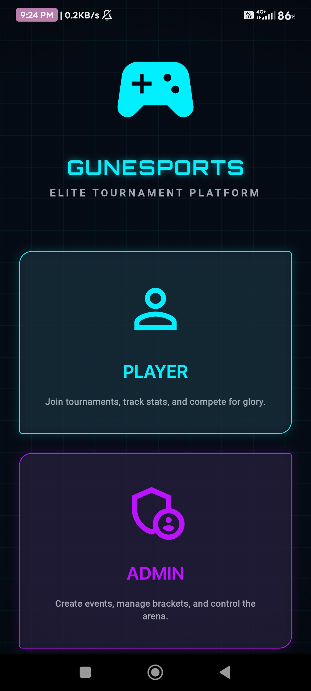
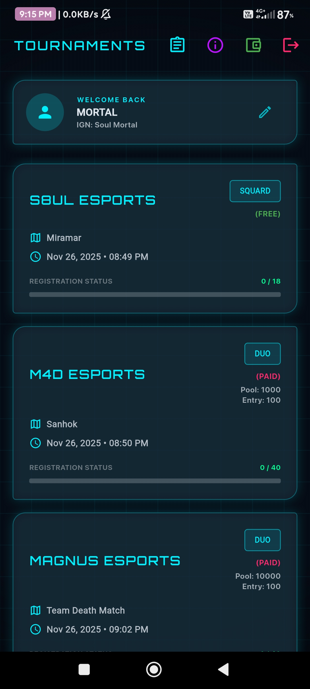
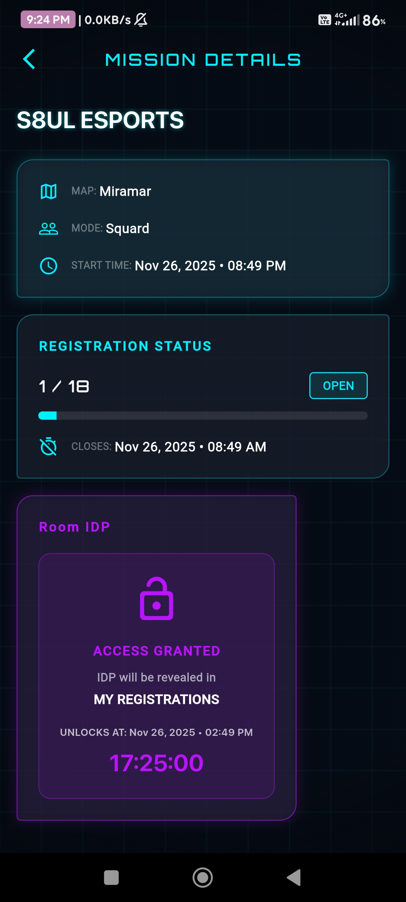
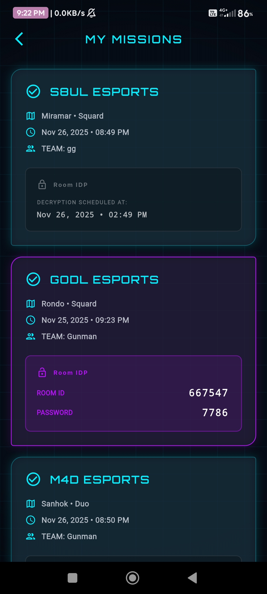
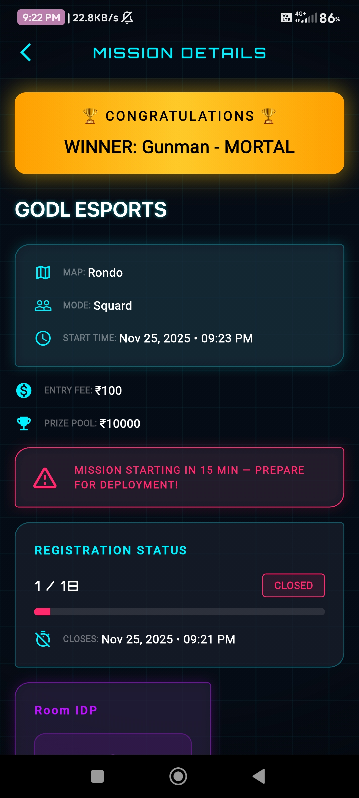
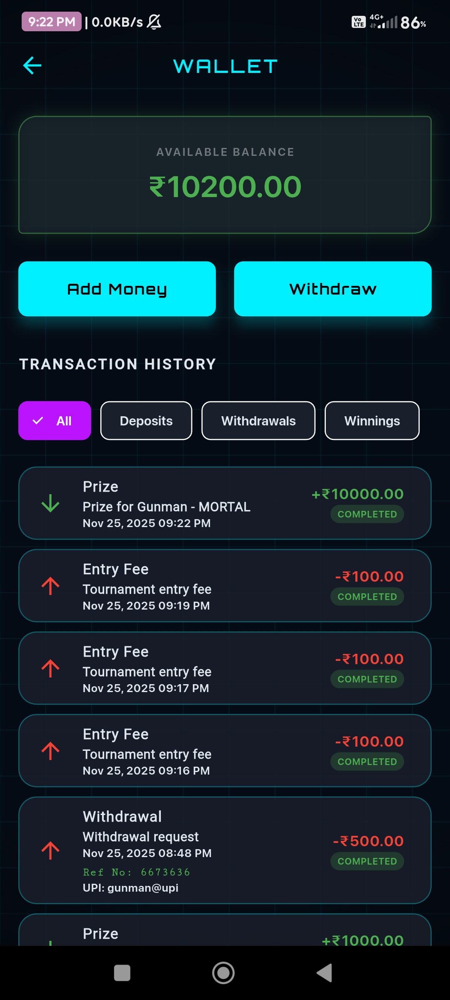

  
  
  # GunEsports - PUBG Tournament Manager
  
  
  
  

  **Manage and join PUBG Mobile tournaments with ease**

  [**⬇️ Download Latest APK**](https://github.com/MADxGUNMAN/GunEsports-apk/releases/download/1.2.0-release/GunEsports.apk)

---

## 📖 About GunEsports

**GunEsports** is the ultimate PUBG Mobile tournament management platform designed for esports enthusiasts, tournament organizers, and competitive players. Whether you're a competitive player looking for tournaments or an organizer managing esports events, GunEsports provides all the tools you need in one sleek, user-friendly application.

### 🎮 Key Features

*   **Tournament Management**: Create and manage PUBG Mobile tournaments effortlessly.
*   **Registration System**: Easy player registration and team management.
*   **Developer Profiles**: Showcase game developers and content creators.
*   **Social Integration**: Connect via YouTube, Instagram, Facebook, WhatsApp & more.
*   **Real-time Updates**: Stay updated with tournament schedules and results.
*   **Admin Dashboard**: Comprehensive control panel for organizers.
*   **Map & Mode Selection**: Custom game modes and map configurations.

---

## 📸 Screenshots

| Home & Tournaments | Details & Registration |
|:---:|:---:|
|  |  |
| **Registration** | **Profile & More** |
|  |  |
| **Admin Dashboard** | **Management** |
|  |  |

---

## ⚡ For Players & Organizers

### For Players
*   Browse upcoming tournaments
*   Quick and easy registration
*   Track your tournament history
*   View developer profiles and content
*   Connect with the gaming community

### For Organizers
*   Full tournament creation and management
*   Player registration oversight
*   Custom game configurations
*   Admin controls and moderation
*   Real-time tournament updates

---

## 🔗 Connect With Us

*   **Developer Website**: [souaibproject.netlify.app](https://souaibproject.netlify.app)
*   **YouTube**: [MADxGUNMAN](https://youtube.com/@madxgunman2011)

---

  Note: This app requires an internet connection. PUBG Mobile is a trademark of KRAFTON, Inc. This app is not affiliated with or endorsed by KRAFTON, Inc.

